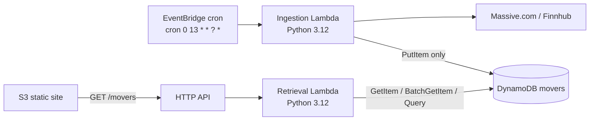

# Stocks Serverless Pipeline

Daily tech-watchlist top-mover tracker on AWS Free Tier: EventBridge wakes an ingestion Lambda once a day, records the largest absolute % move in DynamoDB, and a public HTTP API + S3 site show the last 7 days.

**Deliverables**

| Item | Where |
|------|--------|
| Public GitHub repo | https://github.com/georgekoranteng5/stocks-serverless-pipeline |
| Live frontend | _(paste S3 website URL after deploy)_ |
| Live API | `terraform output -raw movers_url` |

## Architecture



| Path | Flow | IAM |
|------|------|-----|
| **Write** | EventBridge → ingestion Lambda → stock API → DynamoDB | `dynamodb:PutItem` on movers table only |
| **Read** | Browser → S3 → HTTP API `GET /movers` → retrieval Lambda → DynamoDB | `GetItem` / `BatchGetItem` / `Query` only |
| **Tags** | All tagged via provider `default_tags` | `Project`, `Environment`, `ManagedBy=terraform` |

### Data model

| | |
|---|---|
| **Table** | `{project_name}-{environment}-movers` |
| **Partition key** | `date` (`YYYY-MM-DD`) — one winner per day |
| **Attributes** | `date`, `ticker`, `percent_change`, `closing_price`, `created_at` |
| **Billing** | `PAY_PER_REQUEST` (on-demand) |
| **PITR** | Off by default |

Last-7-days reads use **BatchGetItem** for seven known date keys (PK-only design — no cross-day Query / no GSI).

### Ingestion

`lambdas/ingestion/handler.py` — watchlist `AAPL MSFT GOOGL AMZN TSLA NVDA`, `% = ((close-open)/open)*100`, store max **absolute** mover.

- Retries: 3 attempts, exponential backoff (`tenacity`) on rate limits / 5xx
- Partial failure: one ticker can fail; run continues
- Total failure: raises → CloudWatch marks invoke failed
- Secrets: `STOCK_API_KEY` from env (Terraform injects from gitignored `terraform.tfvars`)
- Optional override: `{"trade_date":"YYYY-MM-DD"}` in the invoke payload backfills that session (EventBridge sends `{}` → auto-resolve)

```bash
FUNCTION=$(terraform -chdir=terraform output -raw ingestion_lambda_function_name)
aws lambda invoke --function-name "$FUNCTION" --payload '{}' \
  --cli-binary-format raw-in-base64-out /tmp/ingestion-out.json

# Backfill a historical day (real Massive OHLC for that date)
aws lambda invoke --function-name "$FUNCTION" \
  --payload '{"trade_date":"2026-07-08"}' \
  --cli-binary-format raw-in-base64-out /tmp/backfill.json
```

### Retrieval + API

`GET /movers` → JSON array newest-first; `200` + `[]` if empty; `500` + `{"error":"..."}` on DynamoDB errors (no stack traces to clients). CORS enabled on API + Lambda headers. **No API auth** (public, per spec).

### Frontend

Plain HTML/CSS/JS table (green gains / red losses). Live API URL is **not** hardcoded — `scripts/deploy_frontend.sh` writes gitignored `frontend/config.js` from Terraform output.

## Prerequisites

- Terraform `>= 1.5`
- AWS account + CLI credentials (Free Tier–friendly region, default `us-east-1`)
- [Massive.com](https://massive.com) API key (Finnhub works as code fallback if you point the same `stock_api_key` at Finnhub)
- `python3` + `pip` (used when Terraform packages the ingestion zip)

## Setting the API key (important)

1. Copy the example tfvars (the real file is gitignored):

   ```bash
   cp terraform/terraform.tfvars.example terraform/terraform.tfvars
   ```

2. Edit `terraform/terraform.tfvars` and set:

   ```hcl
   stock_api_key = "YOUR_REAL_KEY_HERE"
   ```

3. **Never commit** `terraform.tfvars`, `.env`, or `frontend/config.js`. Confirm with `git status` / `.gitignore` before pushing.

Terraform passes `stock_api_key` into the ingestion Lambda as `STOCK_API_KEY`. It is marked `sensitive = true` in variables.

## Deployment (`init` → `plan` → `apply`)

From a clean checkout:

```bash
cp terraform/terraform.tfvars.example terraform/terraform.tfvars
# Set stock_api_key as above

cd terraform
terraform init
terraform plan
terraform apply

cd ..
chmod +x scripts/deploy_frontend.sh
./scripts/deploy_frontend.sh
```

Smoke checks:

```bash
# Optional: run ingestion once without waiting for the cron
aws lambda invoke \
  --function-name "$(terraform -chdir=terraform output -raw ingestion_lambda_function_name)" \
  --payload '{}' --cli-binary-format raw-in-base64-out /tmp/out.json && cat /tmp/out.json

curl -i "$(terraform -chdir=terraform output -raw movers_url)"

# Frontend
open "$(terraform -chdir=terraform output -raw s3_website_url)"
```

Confirm in the browser: table loads, colors look right, Network tab shows `GET /movers` with CORS OK.

**Schedule:** default `cron(0 13 * * ? *)` (13:00 UTC daily). Override with `ingestion_schedule_expression` in `terraform.tfvars`.

## Teardown (avoid lingering Free Tier usage)

```bash
aws s3 rm "s3://$(terraform -chdir=terraform output -raw frontend_bucket_name)" --recursive
cd terraform
terraform destroy
```

Empty the website bucket first if `destroy` errors on a non-empty bucket.

## CI/CD (stretch)

GitHub Actions (`.github/workflows/terraform.yml`):

- **Every PR / push:** `terraform fmt -check`, `terraform init -backend=false`, `terraform validate`
- **PR (optional plan):** `terraform plan` when AWS + API key secrets are set
- **Push to `main` (optional apply):** `terraform apply -auto-approve` with the same secrets

Required GitHub Actions secrets for plan/apply jobs:

| Secret | Purpose |
|--------|---------|
| `AWS_ACCESS_KEY_ID` | Deploy credentials |
| `AWS_SECRET_ACCESS_KEY` | Deploy credentials |
| `AWS_REGION` | e.g. `us-east-1` |
| `TF_VAR_stock_api_key` | Injected as Terraform variable |

Without those secrets, fmt/validate still run (safe for forks). To enable plan/apply jobs, also set repository variable `ENABLE_TERRAFORM_AWS=true` (Settings → Variables). For `apply` from CI against infra you created locally, migrate to a remote backend first (see `terraform/backend.tf.example`) so state is shared.

Frontend sync remains `./scripts/deploy_frontend.sh` (can be added to CI later).

## Design notes / trade-offs

| Topic | Choice |
|-------|--------|
| **Least-privilege IAM** | Separate roles — ingestion `PutItem` only; retrieval read actions only; EventBridge/`apigateway` invoke permissions scoped to specific source ARNs |
| **Error handling** | Ingestion: retries + partial success; retrieval: `500` JSON errors, empty `[]` is success |
| **Tagging** | Provider `default_tags` (`Project`, `Environment`, `ManagedBy`) — no duplicated tags on every resource |
| **PK = date** | Simple one-item-per-day model; last-7 uses `BatchGetItem` instead of a GSI |
| **Public S3 + public API** | Required for the static SPA + browser `fetch`; S3 policy is **GetObject only** |
| **Secrets** | `terraform.tfvars` / `config.js` gitignored — never baked into the repo |

## Environment variables

| Variable | Where | Description |
|----------|--------|-------------|
| `stock_api_key` | `terraform.tfvars` | Massive/Finnhub key → Lambda `STOCK_API_KEY` |
| `aws_region` | `terraform.tfvars` | Default `us-east-1` |
| `project_name` / `environment` | `terraform.tfvars` | Naming + tags |
| `ingestion_schedule_expression` | `terraform.tfvars` | EventBridge cron/rate |
| `window.API_URL` | `frontend/config.js` | Generated movers URL |

## Repository layout

```
frontend/                 # Static SPA
lambdas/ingestion/        # Writer Lambda
lambdas/retrieval/        # Reader Lambda
scripts/deploy_frontend.sh
terraform/                # Root + modules (dynamodb, lambdas, eventbridge, api_gateway, s3_frontend)
.github/workflows/        # Terraform CI
```
